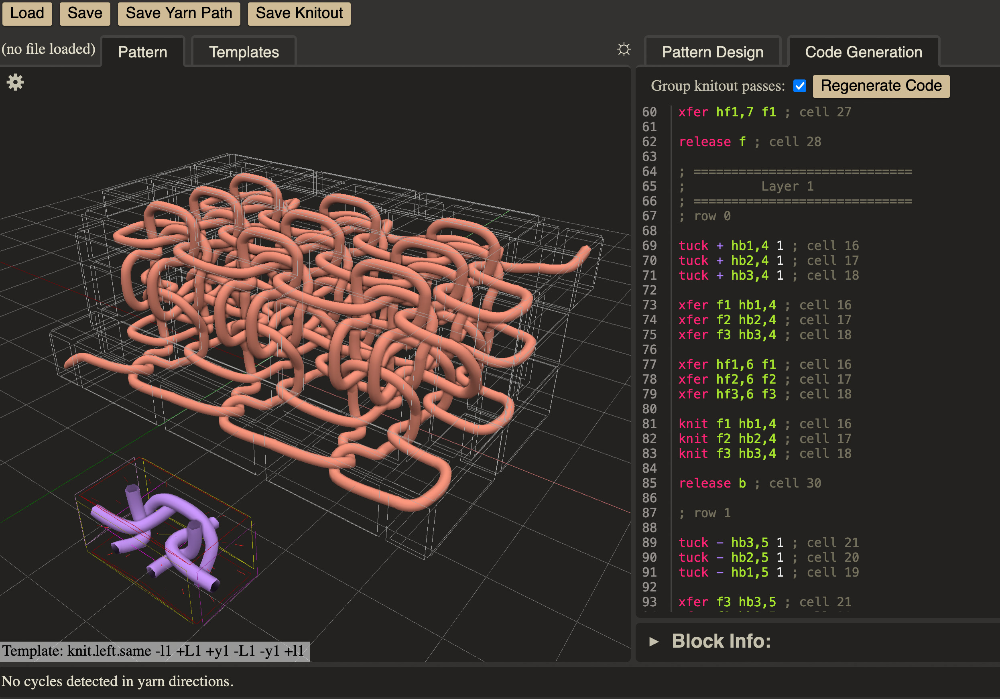

# Solid Knitting UI
Tool to build patterns for solid knitting with interactive preview from "[Solid Knitting]()" by [Yuichi Hirose](https://hirose-yuichi.github.io/), [Mark Gillespie](https://www.markjgillespie.com), [Angelica M. Bonilla Fominaya](https://abfominaya.com/), and [James McCann](https://www.cs.cmu.edu/~jmccann/) at SIGGRAPH 2024.



If this code contributes to academic work, please cite as:
```bibtex
@article{hirose:2024:solid-knitting,
author = {Hirose, Yuichi and Gillespie, Mark and Bonilla Fominaya, Angelica M. and McCann, James},
year = {2024},
title = {Solid Knitting},
journal = {ACM Trans. Graph.},
volume = {43},
number = {4},
articleno = {88},
month = {jul},
numpages = {15},
url = {https://doi.org/10.1145/3658123},
doi = {10.1145/3658123},
publisher = {Association for Computing Machinery},
address = {New York, NY, USA},
}
```

## Running the code
Must be accessed via a web server so it can `fetch()` data files. To do this locally you can use python's built-in web server:
```
$ python3 -m http.server 8080
$ firefox http://localhost:8080/index.html
```

## Loading Patterns
By default, the visualizer loads the 3x3x3 cube from `patterns/cube-3x3.body`. You can use the `Load` button at the top left to load other patterns from the `patterns/` folder.

## Editing Patterns
The current pattern is displayed on the left of the screen. You can modify the pattern using the following commands:

### Commands
* `A`: add a block at your current cursor location
* `G`: grab the block under your cursor (click to place the block, or press escape to cancel the grab command)
* `X`: delete the block under your cursor
* `Enter`: select the block type under your cursor to place more blocks of that type
* `E`: extrude the block under your cursor outwards by placing a matching neighbor
* `W`: extrude the block under your cursor and all of the faces of neighboring blocks in this plane
* `C`: connect the face under your cursor to another face (press `C` again while hovering over a different face to form the connection, or press escape to cancel)
* `Up`/`Down`: select the previous/next block type in the `Block Library` list
* `J`/`K`: select the previous/next block type which can be attached to the face under your cursor
* `S`: select the block/face under your cursor. Then you can perform commands on it by clicking the command in the `Commands` list
* `Ctrl-Z`: undo
* `Esc`: cancel the current grab, connect, or select action
* `Space` or `R`: use iterative relaxation to pull blocks towards each other

The `Block Library` panel at the top right lists all of the available blocks to build patterns with. You can inspect the different kinds of blocks individually by clicking on the `Templates` tab at the top left. Clicking on the `Pattern` tab at the top left brings you back to the pattern.

Pressing the settings gear at the top left of the `Pattern` view opens up a menu with various visualization options, allowing you to change the visualization of the pattern, or toggle the visibility of different layers in order to inspect the internal structure.

## Code Generation
After modifying the pattern, you can generate the corresponding solid knitout code by clicking on the `Code Generation` tab at the top right and clicking the `Regenerate Code` button.

Generating the code also populates the various scheduling information for the blocks in the pattern (such as the bed to make the stitch on, and the needle location for the stitch), which can be viewed in the `Block Info` panel at the bottom right. To modify these values, you can select a block by pressing `S` and change the values in this panel, and then you can regenerate the code.

Once you are satisfied with the generated code, you can export it by clicking the `Save Knitout` button at the top left.

## Included Structures

 - `cube-3x3.body` is a pattern for a simple 3x3x3 cube
 - `triangular-prism.body` is the example from Figure 14, middle
 - `long-rectangular-prism.body` is the example from Figure 14, bottom
 - `partial-pyramid-(x|y|z).body` show different types of increase/decrease (as per Appendix A)


## Acknowledgements
This code is based, loosely, on https://github.com/textiles-lab/smobj/tree/master/web which is, in turn, based on the MDN WebGL tutorials.